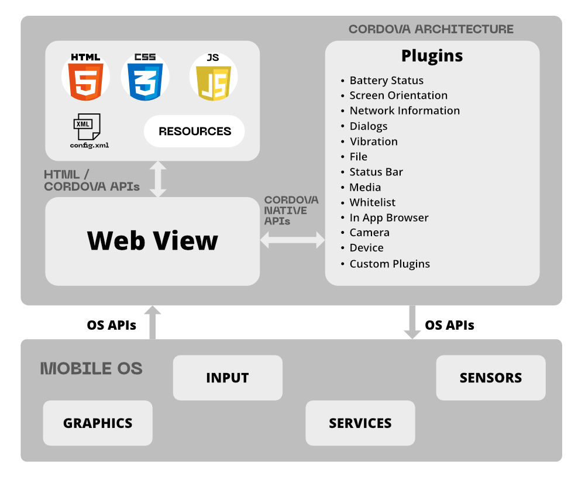

Embarking on the journey of multi-platform app development, I had high hopes and a desire to find the perfect framework. This article is a reflection of my honest perspectives as I navigated through the realms of Apache Cordova, Ionic + Capacitor, and React Native + Expo. Join me as I recount my experiences, highlighting the strengths and weaknesses of each approach, all from my personal point of view.

## Apache Cordova: A Promising Start Filled with Challenges

*A diagram showing the architecture of Apache Cordova. (GeeksForGeeks: https://www.geeksforgeeks.org/what-is-apache-cordova/)*

Apache Cordova initially captured my attention with its concept of utilizing web technologies for mobile app development. However, as I delved deeper, the reality of writing and tweaking XML files became a cumbersome task. Debugging issues, especially on the native side, proved to be a significant challenge. Though I appreciate the potential of Cordova, these hurdles led me to question its suitability for my needs.
    
## Ionic + Capacitor: Bridging the Gap

In search of a more efficient solution, I turned to [Ionic](https://ionicframework.com/) + [Capacitor](https://capacitorjs.com/). This combination provided a vast array of predefined, native-like web component UIs through Ionic, and Capacitor proved to be a great bridge for accessing native-side APIs. However, I must honestly acknowledge the production performance concerns that arose. Animations suffered from excessive frame drops, leaving me questioning whether my code was well-optimized. Despite my best efforts, the performance of my apps, particularly on low-end devices, left much to be desired.

In my quest to better understand the performance discrepancies, I came across an article that provided a side-by-side comparison of Ionic and React Native performance[^1]. While the article showcased favorable performance results for React Native, I couldn't achieve the same level of performance in my implementation. This discrepancy may be attributed to factors such as code optimization. As a solo developer, I found myself limited in bandwidth to continuously tweak and optimize my code. However, I commend the effort invested in Ionic + Capacitor for providing a rich set of native-like UI components and seamless native-side API integration.

## React Native + Expo: Performance Revelation and Convenient Libraries

[React Native](https://reactnative.dev/) + [Expo](https://expo.dev/) became the turning point in my journey. While initially apprehensive about the JSX/TSX syntax, I was quickly won over by React Native's exceptional performance. It delivered the usability and stability I had been striving for, all within the same effort I had invested in Ionic + Capacitor. Moreover, the extensive library ecosystem available for React Native made my life as a developer significantly easier. I found myself embracing the wealth of external libraries and resources that were readily accessible, empowering me to build robust and feature-rich apps.

As I ventured further, I discovered that Expo, a framework and platform built around React Native, offered additional convenience with its rich set of tools and services. It facilitated the development process by providing seamless access to various device APIs, simplifying build and deployment, and enhancing the overall development workflow. The availability of Expo SDK features further augmented my development experience, enabling me to create versatile applications with ease.

---

During my exploration of multi-platform app development, NativeScript caught my attention as another potential framework. NativeScript offered the promise of building cross-platform applications using JavaScript or TypeScript. However, it became apparent that NativeScript had a significant limitation—it lacked the ability to build web applications. Unlike React Native, which has the react-native-web library and the support of many Expo SDK features for web development, NativeScript focused solely on mobile platforms. While NativeScript has its merits, this limitation prevented me from considering it as a comprehensive cross-platform solution for my needs.

---

While each framework has its strengths and weaknesses, it's important to evaluate them based on your specific requirements and preferences. As a developer, my journey has been shaped by my honest perspectives and experiences, and I hope that sharing them will assist others on their own path to successful multi-platform app development.

[^1]: https://ionic.io/blog/ionic-vs-react-native-performance-comparison